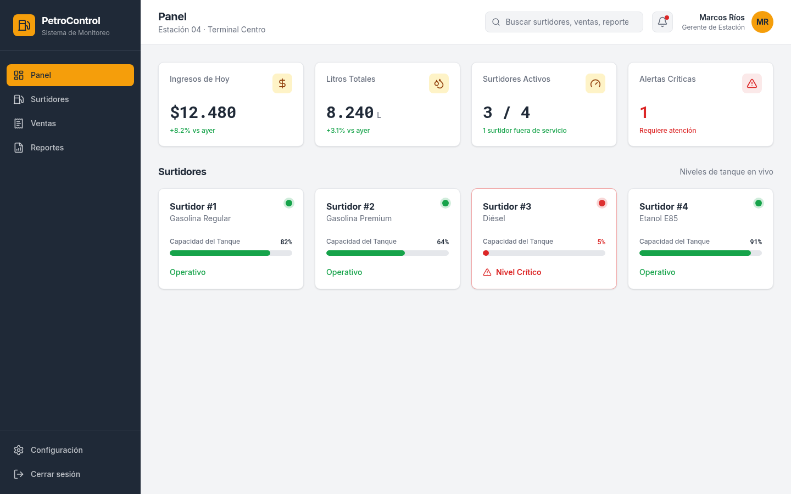
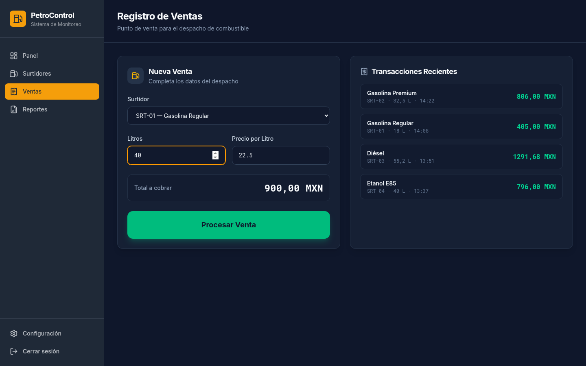
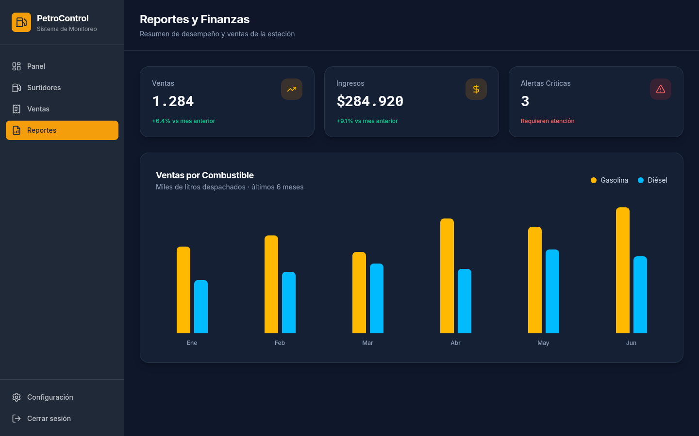
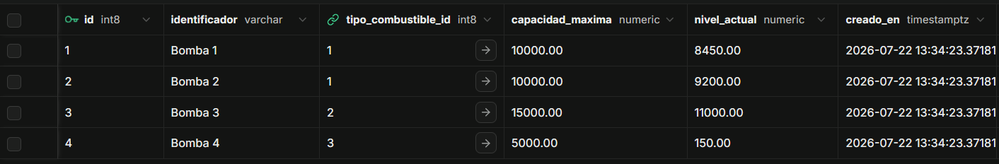
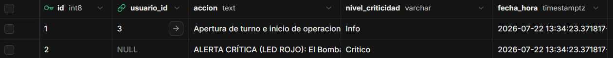

#  PetroControl - Sistema de Monitoreo de Estaciones de Servicio

PetroControl es un sistema integral de gestión y monitoreo en tiempo real diseñado para estaciones de servicio. Permite la administración de inventarios de combustible, registro transaccional de ventas y un sistema automatizado de alertas críticas por hardware simulado (indicadores LED de estado).

---

##  Tecnologías Utilizadas

Este proyecto fue desarrollado utilizando un stack moderno para asegurar un rendimiento nativo multiplataforma y una sólida arquitectura de base de datos en la nube:

### Frontend (Multiplataforma)

* **Flutter & Dart:** Framework principal para el desarrollo de la interfaz. Arquitectura basada en *Widgets* para construir un Dashboard industrial responsivo (Desktop / Web).
* *(Nota: El diseño inicial y prototipado visual se modeló utilizando herramientas generativas web).*

### Backend y Base de Datos

* **Supabase (`supabase_flutter`):** Backend-as-a-Service (BaaS) para la conexión nativa desde la aplicación a la base de datos en la nube.
* **PostgreSQL (PL/pgSQL):** Base de datos relacional (3FN). Uso intensivo de *Triggers* y *Stored Procedures* para el cálculo automático de inventarios y registro de alertas, delegando la carga lógica al servidor.

### Despliegue

* **Render:** Hosting en la nube planificado para el despliegue de la versión compilada en **Flutter Web**.

---

## 🚀 Características Principales

* **Monitoreo en Vivo (Dashboard):** Visualización del estado de los surtidores con indicadores de capacidad y alertas LED (Verde: Óptimo, Amarillo: Bajo, Rojo: Crítico).
* **Gestión de Ventas:** Registro detallado de despachos, cálculo automático de subtotales por tipo de combustible y métodos de pago.
* **Motor de Reglas SQL:** La deducción de inventario y la generación de alertas se ejecutan a nivel de base de datos, evitando sobrecargar el cliente Flutter.
* **Trazabilidad Forense:** Registro automático (logs) de eventos críticos y operaciones del personal.

---

##  Prototipos de Interfaz (UI/UX)

El diseño prioriza la reducción de fatiga visual y la respuesta rápida ante incidentes.

### 1. Panel de Control Principal (Dashboard)
Visualización general con el estado de los tanques y métricas del turno actual.

### 2. Módulo de Ventas (Punto de Venta)
Interfaz para el registro rápido de despachos de combustible.

### 3. Reportes y Analíticas
Visualización de ingresos, consumo histórico y alertas registradas.

---

##  Arquitectura de Base de Datos

El sistema está construido bajo la Tercera Forma Normal (3FN), garantizando la integridad referencial.

### Tablas Principales
**Surtidores y Niveles (Descuento automático):**

**Logs de Alertas Automatizadas (Generadas por Triggers):**

---

